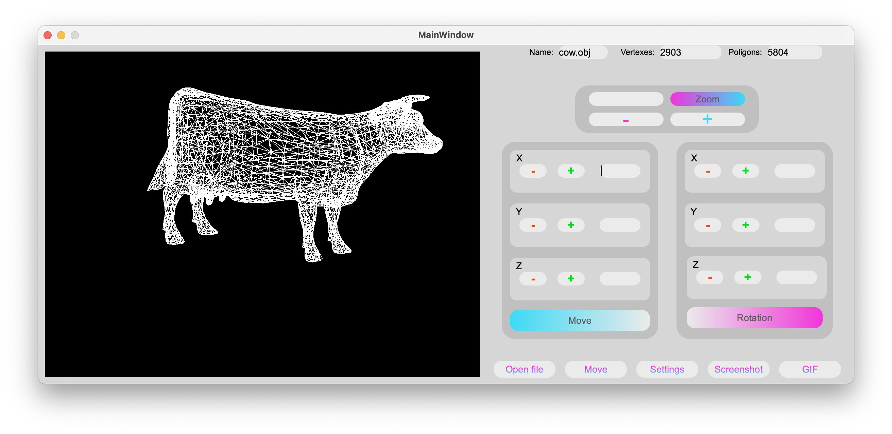
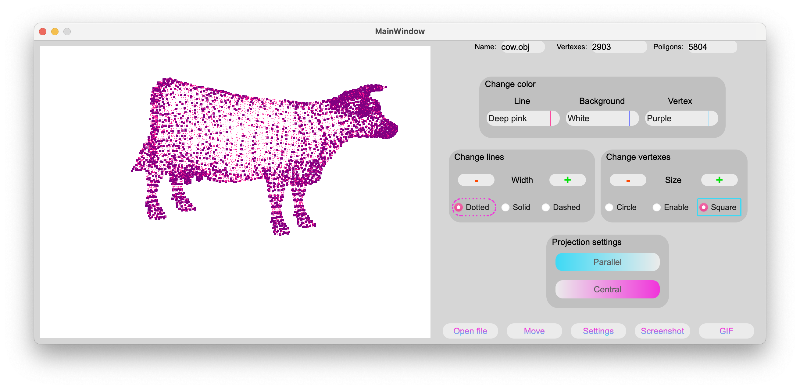

# 3dViewer_v1.0
## Description

Program to view 3D wireframe models in the C programming language. The models themselves must be loaded from .obj files and be viewable on the screen with the ability to rotate, scale and translate.

The app also allow:
    - customizing the type of projection (parallel and central),
    - setting up the type, color and thickness of the edges, display method, color and size of the vertices,
    - choosing the background color,
    - saving settings between program restarts,
    - saving the captured (rendered) images as bmp and jpeg files,
    - recording small screencasts.

* created GUI using C++(QT 6)
* the project is covered with tests using the check.h library (make test)

## Installation

In terminal go to project folder and run make install.

## Uninstallation

In terminal go to project folder and run make uninstall.

## App

In the folder "3dViewer_v1.0" you can find the already builded app.